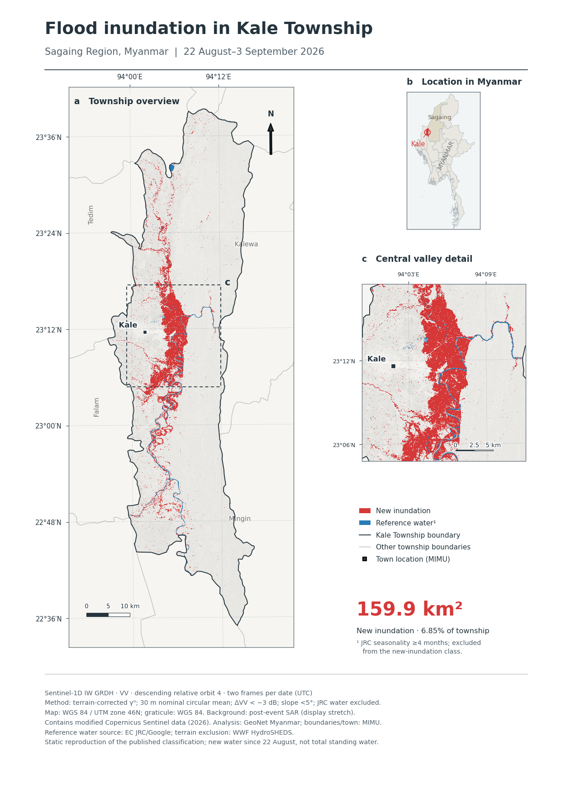

# Kale Township flood inundation — publication map

A reproducible static map of **new inundation between 22 August and
3 September 2026** in Kale Township, Sagaing Region, Myanmar, derived from the
published Sentinel-1 classification by GeoNet Myanmar.



**New inundation: 159.92 km² (6.85% of the township).** The recovered layer
contains 1,739,359 positive pixels and matches the original published area to
floating-point precision.

## Map and data

| Deliverable | File |
|---|---|
| Publication figure, RGB JPEG, 600 dpi, 4962 × 7014 pixels | [Download JPEG](publication/output/kale_flood_publication_600dpi.jpg) |
| PDF companion with vector text and linework | [Download PDF](publication/output/kale_flood_publication.pdf) |
| Original-grid new-inundation mask | [Flood GeoTIFF](publication/output/flood_native.tif) |
| Original-grid JRC reference-water mask | [Reference-water GeoTIFF](publication/output/water_native.tif) |
| Study boundary | [GeoJSON](publication/output/study_area.geojson) |
| Checks, counts, areas, hashes and provenance | [Validation report](publication/output/validation.json) |
| Suggested manuscript caption | [Caption](publication/caption.md) |

The figure includes a township overview, central-valley enlargement, Myanmar
locator, legend, geographic coordinates, true-north arrow and scale bars. The
main panels use WGS 84 / UTM zone 46N. The processed rasters retain the original
EPSG:4326 grid; value 1 is the positive class, 0 means no positive class, and
255 is outside the study area (NoData). Zero includes excluded or potentially
unassessed cells and must not be interpreted as confirmed dry land.

## Reproduce the figure offline

Use Python 3.12. From this repository's root:

```bash
python -m venv .venv
.venv/bin/python -m pip install -r publication/requirements.txt
.venv/bin/python publication/make_map.py
```

The script regenerates `publication/output/` and verifies the recovered class
pixels, georeferencing and area totals. It requires no credentials or remote
data access after dependencies are installed. Use `--output PATH` for a separate
output directory or `--dpi N` for another figure resolution.

## Scientific scope and provenance

This project **reproduces the exact published classification** by decoding the
lossless palette-index PNG layers embedded in the archived `index.html`.
Classification pixels are not redrawn or rethresholded from display imagery.
The source is [geonet-myanmar/kale-flood-20260904](https://github.com/geonet-myanmar/kale-flood-20260904)
at commit [`8f208f3d1a41823b3cbd11b684a80ad7ca2e92cf`](https://github.com/geonet-myanmar/kale-flood-20260904/tree/8f208f3d1a41823b3cbd11b684a80ad7ca2e92cf).

The retained method uses Sentinel-1 VV on the two stated dates, descending
relative orbit 4, CDSE terrain-corrected gamma-zero, a nominal 30 m circular
mean in dB, a post-minus-pre threshold below −3 dB, exclusion of JRC seasonality
≥4 months, and slopes below 5°. Two Sentinel-1D IW GRDH frames per date were
confirmed in the public CDSE catalogue; see [the catalogue record](publication/catalogue_check.json).

**A fresh end-to-end Sentinel-1 classification has not been run for this static
reproduction.** The original Earth Engine access and ancillary terrain/validity
masks were unavailable. The exact published result is preserved without changing
the classification method. New inundation measures change from a monsoon
baseline, not total standing water or damage. No independent ground-truth
accuracy assessment is claimed.

[Full methods and limitations](publication/README.md) explain the angular grid,
filtering, display resampling, area calculation, and the distinction between
reference water and permanent water.

## Optional full analysis rerun

[The rerun wrapper](publication/rerun_workflow.py) invokes the retained upstream
CDSE workflow in a separate directory and keeps its intermediate rasters. It
requires authenticated Earth Engine access with an enabled project and a CDSE
account. Detailed setup is in the [methods documentation](publication/README.md#optional-complete-rerun-of-the-original-analysis).

No credentials are distributed with this project. For a rerun, provide an
external two-line credential file through `--credentials`, or set `CDSE_USER`
and `CDSE_PASSWORD` in the environment. Credential files, tokens, local virtual
environments, raw imagery caches and rerun build directories are ignored by Git.

## Repository layout

```text
publication/
  make_map.py                 offline map and GeoTIFF reproduction
  rerun_workflow.py           optional original analysis rerun
  requirements*.txt           dependencies for each mode
  README.md                   detailed methods and limitations
  caption.md                  suggested manuscript caption
  catalogue_check.json        verified acquisition product names
  output/                     publication figures, rasters and validation
index.html                    archived source dashboard and embedded masks
assets/                       SAR PNGs referenced by the source dashboard
flood_stats.json              original numerical results
flood_mapping_cdse.py          original CDSE analysis workflow
cdse_source.py                 original CDSE client
flood_mapping.py               original shared processing/dashboard helpers
Kale_Township_Boundary.geojson original AOI
MyanmarTownshipBoundaries.geojson  national locator/context boundaries
data/mimu/                    Sagaing villages and national town gazetteer
```

The archived dashboard and all six SAR assets are retained together to preserve
the source product. Unrelated regional village caches and the old Earth Engine
scene-polling script have been removed. The processing code and scientific
inputs used to produce the publication figure remain unchanged.

## Attribution

Original analysis and code: © 2026 GeoNet Myanmar. Contains modified Copernicus
Sentinel data (2026). Administrative boundaries and settlement locations: © MIMU,
under the applicable MIMU data terms. Reference-water source: EC JRC/Google;
terrain exclusion: WWF HydroSHEDS. The original source does not include a
standalone software license; this project does not assign a new license to
third-party code or data. Source citations are listed in the
[methods documentation](publication/README.md#caption-and-sources).
